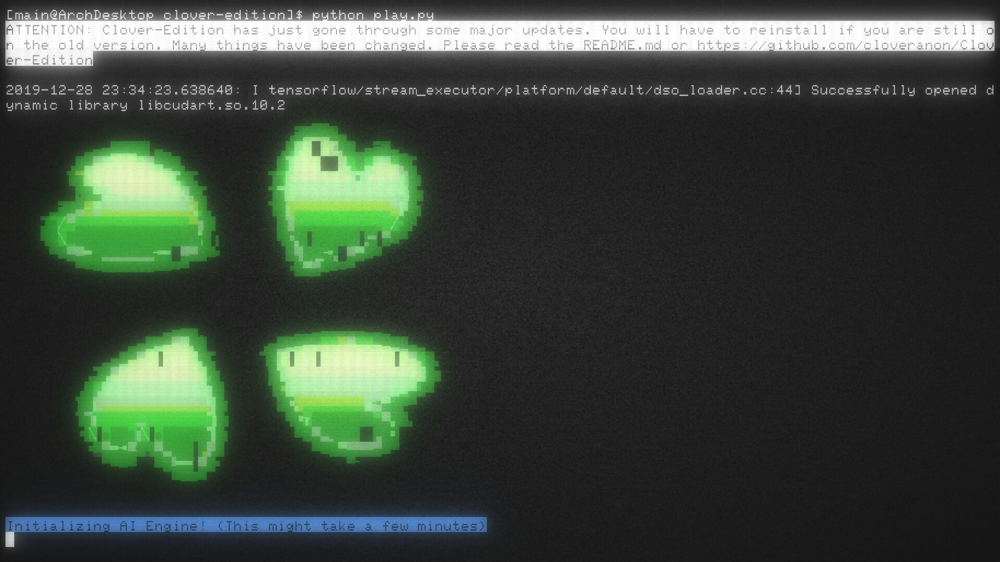
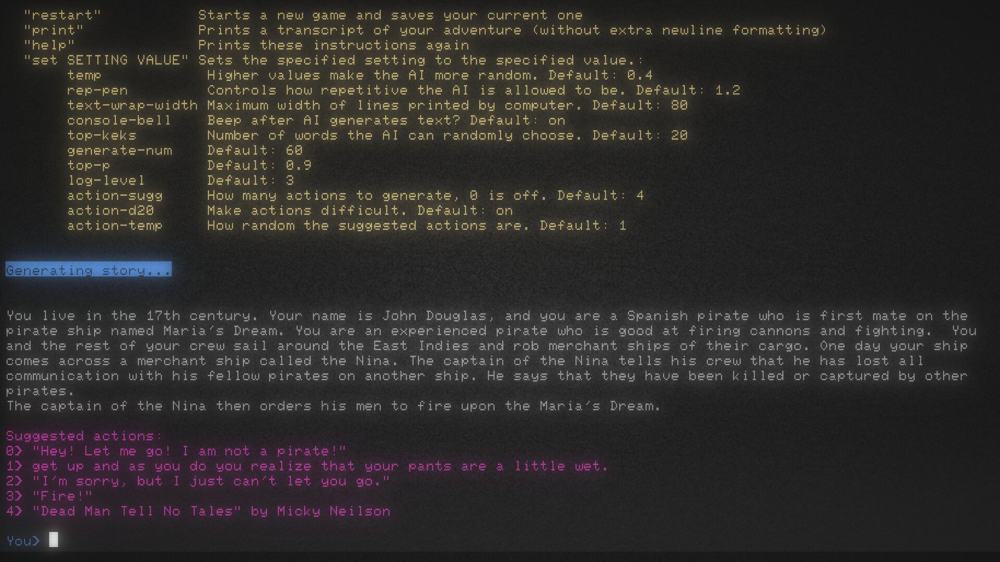
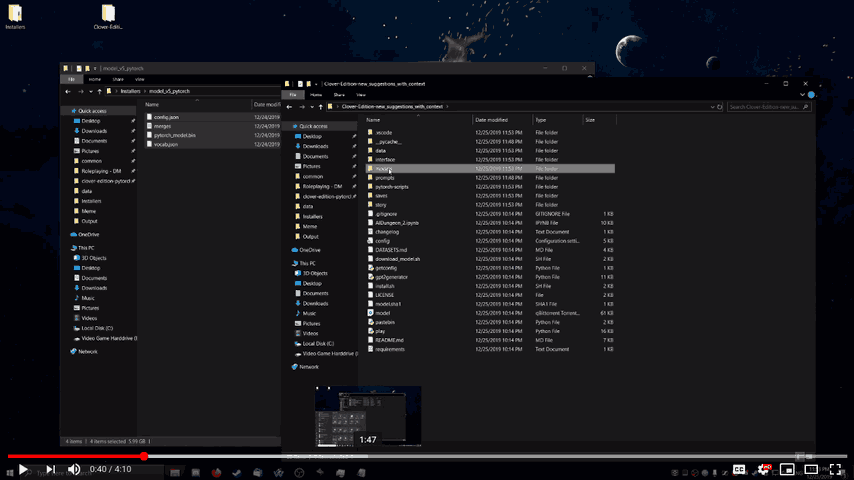

# AIDungeon2

## Clover Edition

### Pytorch Edition

In 2016, Donald Trump ran for president on a campaign of Making Anime Real. Four years later this promise is finally being fullfilled. Behold AID2: Clover Edition. The only video game where you can truly Do Anything:






Also take a look at [AIDungeonPastes](https://aidungeonpastes.github.io/AID2-Art/) for some drawn gameplay examples.

A fork of AIDungeon2, now driven by huggingface's transformers repository using PyTorch GPT2.

#### Features

------------------------

* Complete rewrite of the user interface
  * Colored text
  * Suggested actions
  * Console Bell dings when the AI finishes
  * Much improved prompt selection
  * Ability to save custom prompts
* Half precision floating point using significantly less GPU memory
* Repetition Penalty to reduce AI looping behavior
* A much larger library of fan made starting prompts
* Challenge added with your actions not always succeedeing
* A simple config file
* Lots of changes to story history sampling/truncation to hopefully stay on track with longer games
* Eventually hope to improve the AI itself, but this will take some time

#### Installation Instructions

------------------------

Officially we only support local installs. We encourage and recommend installing and running the game locally. However since the beginning most people have been playing it for free on Google's servers through their Colab platform. Allegedly it requires no effort to get started. Try [this link](https://colab.research.google.com/drive/1kYVhVeE6z4sUyyKDVxLGrzI4OTV43eEa) and go to the [4chan threads](https://boards.4chan.org/search#/aidungeon%20OR%20%22ai%20dungeon%22) for help and info.

Video walkthrough of Windows install:

[](https://www.youtube.com/watch?v=X3jd4c8rHAA "Install AI Dungeon Locally - Clover Edition w/Pytorch")

To play with GPU acceleration, you need an NVIDA GPU with CUDA installed (and possibly cuDNN, read ahead). The original "XL" 1558M parameter model requires at least 4GB of VRAM. Smaller models may consume much less. On CPU response times vary from 30 to 90 seconds on the XL 1558M model, which is slow but usable.

If you'd like to automatically install and setup the game, there are currently two different Windows installers. You can find a batch installer [here](https://github.com/AIDungeonpastes/Clover-Edition-Installer/releases) and a .exe installer [here](https://github.com/AIDungeonWiXAnon/AID2-Installer-Project/releases), or you can manually install by following the instructions below: 

I should mention a program called [Anaconda](https://docs.anaconda.com/anaconda/install/) and its little sibling [Miniconda](https://docs.conda.io/en/latest/miniconda.html) that claims to make it easy to install most of this stuff with a few commands in the terminal (although it already is easy to install most this stuff.) Including installing CUDA and cuDNN. It has been tested and shown to work, but nobody has created a guide for it yet. Report if you end up doing so. Otherwise:

First [install python](https://www.python.org/downloads/). Some users reported problems with python 3.8 so start with version 3.7. The installer should install `pip` and it should add it to your `PATH` automatically. Make sure you have the relevant options selected if the installer gives you any options.

Next install pytorch (aka the `torch` python module.) For GPU support pytorch requires a recent version of NVIDIA's CUDA and may require or benefit from an NVIDIA software called "cuDNN". For just CPU select "None" as your CUDA version. Pytorch's installation instructions are available [here](https://pytorch.org/get-started/locally/) on their official website. You do not need the `torchvision` package. On Windows the command should look like the following:

```bash
pip3 install torch -f https://download.pytorch.org/whl/torch_stable.html
```

Next we'll install the necessary python module `transformers`. This should be done with pip by entering a command like this:

```bash
pip3 install transformers==2.3.0
```

A recommended optional addition for other than Colab users is the Python Prompt Toolkit. It revises the input scheme and provides an alternative color scheme. Install it with the command `pip install -r optional-requirements.txt`

Windows users *may* want to install another module called "colorama". Though it may already be installed. If you see `[27m` glyphs, the color codes aren't working See the color support section.

Then to install just download this repo. Github has a download option somewhere. Or you can use the git command `git clone --depth=1 "https://github.com/cloveranon/Clover-Edition/"`

Then you will need to download a pytorch model and put it in the models folder:

#### Models

The pytorch version of the original AID2 model is being distributed by bittorrent:

[Torrent File](model.torrent)

[Magnet Link](magnet:?xt=urn:btih:17dcfe3d12849db04a3f64070489e6ff5fc6f63f&dn=model_v5_pytorch&tr=udp%3a%2f%2ftracker.opentrackr.org%3a1337%2fannounce&tr=udp%3a%2f%2fopen.stealth.si%3a80%2fannounce&tr=udp%3a%2f%2fp4p.arenabg.com%3a1337%2fannounce&tr=udp%3a%2f%2ftracker.coppersurfer.tk%3a6969%2fannounce&tr=udp%3a%2f%2ftracker.cyberia.is%3a6969%2fannounce&tr=udp%3a%2f%2ftracker.moeking.me%3a6969%2fannounce&tr=udp%3a%2f%2f9.rarbg.me%3a2710%2fannounce&tr=udp%3a%2f%2ftracker3.itzmx.com%3a6961%2fannounce)

```text
magnet:?xt=urn:btih:17dcfe3d12849db04a3f64070489e6ff5fc6f63f&dn=model_v5_pytorch&tr=udp%3a%2f%2ftracker.opentrackr.org%3a1337%2fannounce&tr=udp%3a%2f%2fopen.stealth.si%3a80%2fannounce&tr=udp%3a%2f%2fp4p.arenabg.com%3a1337%2fannounce&tr=udp%3a%2f%2ftracker.coppersurfer.tk%3a6969%2fannounce&tr=udp%3a%2f%2ftracker.cyberia.is%3a6969%2fannounce&tr=udp%3a%2f%2ftracker.moeking.me%3a6969%2fannounce&tr=udp%3a%2f%2f9.rarbg.me%3a2710%2fannounce&tr=udp%3a%2f%2ftracker3.itzmx.com%3a6961%2fannounce
```

The original model has 1558 Million Parameters. It is 5.9GiB and requires >8GB of VRAM to run normally on a GPU and >4GB of VRAM to run at our reduced 16 bit mode.

It is possible to play on a GPU with less than 4GB of VRAM with smaller models. Many anons have trained smaller models (see the section on Finetuning). We need volunteers to convert other models to pytorch and create torrents for them.

Ideally I would like to have a single torrent with every model anyone cares about. Both 32bit and 16bit versions. And users could just select what files they want or even get all of them.

I believe it is possible to update or add new files to a torrent. For when new models come out. I believe this can be done by creating a new torrent. And asking users to delete the old one from their torrent program, and to run a checksum on the new torrent so it can recognize the existing files.

I'd do this myself however my internet speed is so bad it will take me days to get all of the models and longer to seed them.

Once downloaded your model folder should look like this:

```text
    ./models
    └── <MODEL-NAME>
        ├── config.json
        ├── merges.txt
        ├── pytorch_model.bin
        └── vocab.json
```

#### Text to Speech

Install optional requirements, or just run `pip install --upgrade google-cloud-texttospeech`

To setup WaveNet voices for Text to Speech, we'll need to setup Google Cloud Platform.

Follow the [Quickstart guide](https://cloud.google.com/text-to-speech/docs/quickstart-client-libraries#client-libraries-install-python) and make sure to et `GOOGLE_APPLICATION_CREDENTIALS` to location of JSON file with credentials on your machine.

To play, just enter the folder and run "play.py" with python3. From the command line:

```bash
cd Clover-Edition
python3 play.py
```

##### Color support on Windows

* Install a python package called `colorama` and it should work. This may already be installed by pip. Which I believe is installed automatically with python. Some users report this does not fix all of the color codes, especially on user input.
* Install a windows program called "ansi.sys"
* Use an alternative terminal emulator to the default **command prompt**.
  * **Powershell** generally works better than the default terminal and is already installed with Windows. But it doesn't support color by default either.
  * The new **Windows Terminal** supports color by default and is in beta. You currently have to install it from the windows store until it is officially released.
  * An anon has reported that **ConEmu** works great.
  * There are a number of other terminal emulators for windows, I think one even comes with git for windows.
* Windows 10 users can edit a registry key (look up `Registry Editor`) at `HKEY_CURRENT_USER\Console\VirtualTerminalLevel` to `1` to permanently enable color support
* Try using the Windows Subsystem for Linux.
* use a bat program to enable the `ENABLE_VIRTUAL_TERMINAL_PROCESSING` flag via the `SetConsoleMode` API (not sure what the exact .bat command would be), then run the python script. (If someone figures this out I can put it in the repo and windows users can just run it without doing anything.)

##### Troubleshooting for Linux

* If pip commands fail because of an unsupported default Python version, try it with
`supported_Python_version -m pip install -r requirements.txt` where `supported_Python_version` is replaced with a supported Python version (they might be 3.5 to 3.7.6 but don't quote me on that).

#### Datasets and Finetuning the AI

------------------------

I threw together a quick page of some tips [here](DATASETS.md). I plan to throw any links to interesting datasets or guides for training and finetuing the AI there. Please send me anything interesting.

Fine tunning is not currently a push button thing and requires some minimal technical ability. Most people are using the program gpt-simple. You may have more luck with the much more advanced [Huggingface-Transformers](https://github.com/huggingface/transformers) program that we use to power Clover-Edition. [This](https://huggingface.co/transformers/examples.html#language-model-fine-tuning) seems to be their documentation on fine-tuning.

Anon says: "Here's an ipynb you can train new models with using the transformers lib that clover edition uses directly, rather than having to convert it: https://0x0.st/zDRC.ipynb "

#### Converting Tensorflow model to Pytorch

------------------------

I have made the [convert_gpt2_model.py](convert_gpt2_model.py) script an idiot proof simple way of quickly converting tensorflow models to pytorch models. Just run it on the folder containing a tensorflow model and you will get a pytorch model. You can use the --full flag to get a full 32bit model, but do try 16bit models as they will be potentially half the size for the same accuracy.

See the [test-models.py](test-models.py) script to test the accuracy of 16 bit mode if you doubt the chad 16BIT models. My tests were well within expectations.

#### Community

------------------------

See that github issues page? Post any questions, requests, or problems there if you are willing to create a github account. Unless MicroAndSoft deletes us.
Otherwise see:

* **Website**: [4chan Discussion](https://boards.4chan.org/search#/aidungeon%20OR%20%22ai%20dungeon%22)
* **Email**: cloveranon@nuke.africa

#### Contributing

------------------------
Contributions are more than welcome. You can fork the thing and send a  [pull request](https://help.github.com/articles/using-pull-requests/) from your fork. Or you can possibly just edit the files from the github page if it lets you. If not fork the thing and try to edit your fork and submit it back.


